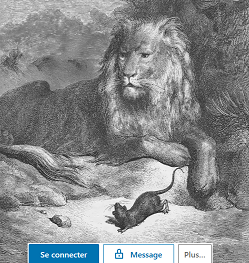

## Les Fables de la Fontaine, The Social Network

Qui a lu l'intégralité des fables de La Fontaine? Nous en connaissons tous une douzaine, peut-être deux ou trois par coeur, mais la partie immergée de l'iceberg reste largement méconnue. L'oeuvre de La Fontaine ne se limite d'ailleurs pas aux fables, mais ces dernières constituent un corpus particulièrement fécond et puissant de l'imaginaire collectif français, écrit à la toute fin du 17ème siècle. Les fables mettent en scène hommes, animaux, dieux, voire même objets inanimés de manière parfois mixte. L'auteur, qui s'inspirait régulièrement de textes d'Esope pour les mettre en vers ou les enrichir de péripéties, a dépeint un tableau peu flatteur de l'espèce humaine. Plutôt que bons et méchants, une lecture complète fait émerger un univers dans lequel les rusés et les forts tirent leur épingle du jeu.

Cette fois-ci, il ne sera pas question d'analyser le texte des fables, mais d'en extraire des **relations** et hiérarchies entre animaux. L'idée de cette étude est d'analyser les fables selon les types d'animaux qui y sont représentés, de voir ceux qui sortent gagnants ou perdants de l'histoire (sans aucune considération morale), ainsi que les relations entre les fables selon le type d'animal. 

Mais avant de démarrer, commençons par quelques statistiques ennuyeuses sur les fables elles-mêmes. Réparties en 12 livres, les 244 fables donnent vie à 67 animaux différents\*, 8 personnages inanimés (ex: le chêne et le roseau), ainsi que des Dieux ou entités surnaturelles comme Jupiter, la Mort ou la Providence. Il y a en moyenne 2.1 personnages par fable, si on compte les humains dedans.

<h6> <i> certains animaux ont été regroupés manuellement, étant de caractère très proche comme le serpent ou la couleuvre. D'autres ont été à dessein laissés séparés comme la poule et le coq, dont la symbolique respective est finalement assez éloignée. La liste est visible dans ce [fichier texte](https://gitlab.com/agenis/la-fontaine-social-network/blob/master/fusions_d_animaux.txt). </h6> </i> 

<i>*Une grenouille vit un boeuf*  
Qui lui sembla de belle taille.  
Elle, qui n'était pas grosse en tout comme un oeuf, 
Envieuse, s'étend, et s'enfle et se travaille, 
Pour égaler l'animal en grosseur, 
Disant: "Regardez bien, ma soeur; 
Est-ce assez? dites-moi: n'y suis-je point encore? 
Nenni- M'y voici donc? -Point du tout. M'y voilà? 
-Vous n'en approchez point."La chétive pécore 
S'enfla si bien qu'elle creva. 
Le monde est plein de gens qui ne sont pas plus sages. 
Tout bourgeois veut bâtir comme les grands seigneurs , 
Tout prince a des ambassadeurs, 
Tout marquis veut avoir des pages.</i>

Dans cette fable classique, j'attribue un score de `-1` à la grenouille qui fait les frais de la morale, mais de `0` au boeuf (il fait la figuration). J'avoue que dans certains cas le codage est sujet à interprétation.

Une autre source de données est utilisée pour caractériser les animaux: la [taxonomie](http://informations-documents.com/environnement.ecole/regne_animal_1.htm) du règle animal, afin d'attribuer à chacun la classe qui lui revient: mammifère, oiseau, etc. Deux autres variables codées à la main sont le caractère carnivore ou herbivore, et le caractère domestiqué ou sauvage de l'animal. Le nombre de citations de chaque animal, selon sa classe taxonomique est présenté ci-dessous:

