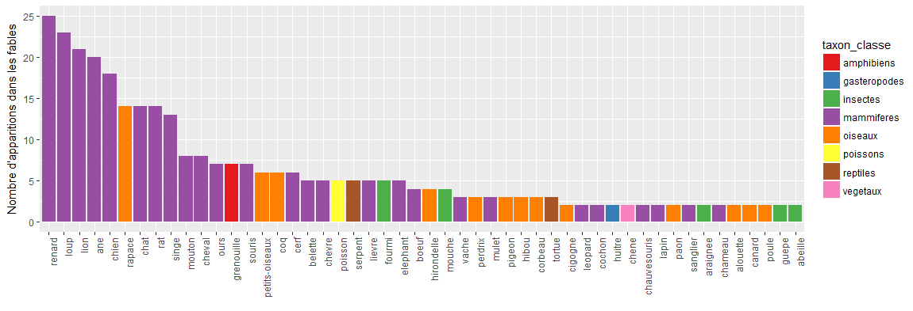

## Les Fables de la Fontaine, The Social Network

Qui a lu l'intégralité des fables de La Fontaine? Nous en connaissons tous une douzaine, peut-être deux ou trois par coeur, mais la partie immergée de l'iceberg reste largement méconnue. L'oeuvre de La Fontaine ne se limite d'ailleurs pas aux fables, mais ces dernières constituent un corpus particulièrement fécond et puissant de l'imaginaire collectif français, écrit à la toute fin du 17ème siècle. Les fables mettent en scène hommes, animaux, dieux, voire même objets inanimés de manière parfois mixte. L'auteur, qui s'inspirait régulièrement de textes d'Esope pour les mettre en vers ou les enrichir de péripéties, a dépeint un tableau peu flatteur de l'espèce humaine. Plutôt que bons et méchants, une lecture complète fait émerger un univers dans lequel les rusés et les forts tirent leur épingle du jeu.

Cette fois-ci, il ne sera pas question d'analyser le texte des fables, mais d'en extraire des **relations** et hiérarchies entre animaux. L'idée de cette étude est d'analyser les fables selon les types d'animaux qui y sont représentés, de voir ceux qui sortent gagnants ou perdants de l'histoire (sans aucune considération morale), ainsi que les relations entre les fables selon le type d'animal. 

Mais avant de démarrer, commençons par quelques statistiques ennuyeuses sur les fables elles-mêmes. Réparties en 12 livres, les 244 fables donnent vie à 67 animaux différents\*, 8 personnages inanimés (ex: le chêne et le roseau), ainsi que des Dieux ou entités surnaturelles comme Jupiter, la Mort ou la Providence. Il y a en moyenne 2.1 personnages par fable, si on compte les humains dedans.

<h6> <i> certains animaux ont été regroupés manuellement, étant de caractère très proche comme le serpent ou la couleuvre. D'autres ont été à dessein laissés séparés comme la poule et le coq, dont la symbolique respective est finalement assez éloignée. La liste est visible dans ce [fichier texte](https://gitlab.com/agenis/la-fontaine-social-network/blob/master/fusions_d_animaux.txt). </h6> </i> 

Une autre source de données est utilisée pour caractériser les animaux: la [taxonomie](http://informations-documents.com/environnement.ecole/regne_animal_1.htm) du règle animal, afin d'attribuer à chacun la classe qui lui revient: mammifère, oiseau, etc. Deux autres variables codées à la main sont le caractère carnivore ou herbivore, et le caractère domestiqué ou sauvage de l'animal. Le nombre de citations des 50 premiers animaux, selon sa classe taxonomique, est présenté ci-dessous, et on retrouve naturellement les animaux familiers dans les plus cités: mammifère de façon écrasante, puis oiseaux, etc.

## "Score" d'un personnage

J'ai souhaité attribuer à chaque animal un score défini comme le nombre de cas d'où il sort "vainqueur" moins le nombre de cas d'où il sort "perdant". 

<i>*Une grenouille vit un boeuf*  
Qui lui sembla de belle taille.  
Elle, qui n'était pas grosse en tout comme un oeuf, 
Envieuse, s'étend, et s'enfle et se travaille, 
Pour égaler l'animal en grosseur, 
Disant: "Regardez bien, ma soeur; 
Est-ce assez? dites-moi: n'y suis-je point encore? 
Nenni- M'y voici donc? -Point du tout. M'y voilà? 
-Vous n'en approchez point."La chétive pécore 
S'enfla si bien qu'elle creva. 
Le monde est plein de gens qui ne sont pas plus sages. 
Tout bourgeois veut bâtir comme les grands seigneurs , 
Tout prince a des ambassadeurs, 
Tout marquis veut avoir des pages.</i>

Ainsi, dans cette fable classique, j'attribue un score de `-1` à la grenouille qui fait les frais de la morale, mais de `0` au boeuf (il fait la figuration). J'avoue que dans certains cas le codage est sujet à interprétation, comme pour la fable du [chien et du loup](http://www.la-fontaine-ch-thierry.net/loupchien.htm) par exemple (Chacun est-il heureux dans son état? Le statut de loup est-il supérieur? Délicat de statuer!). En sommant ces scores unitaires sur l'ensemble des fables, les animaux ont un score net global positif, négatif, ou nul qui s'étend de -6 (le mouton) à +7 (le chat). 

On peut alors distinguer plusieurs groupes d'animaux (inutile de faire une ACP ici, un plot XY des scores positifs et négatifs est parlant): les petits animaux qui sont peu cités forment un gros tas, les animaux qui sont très souvent présents et "victimes" de la fable en haut à gauche, les animaux qui sont très cités et presque toujours vainqueurs (en bas à droite), et ceux qui cumulent de nombreuses victoires et défaites: le loup, le renard, le lion. Le loup et le renard ont les mêmes résultats sauf lorsqu'ils interagissent ensemble, c'est alors systématiquement le renard qui l'emporte. Le lion sort souvent indemne des fables, mais par des procédés peu enviables (violence, arbitraire), et parfois patît, malgré sa force, de nombreux ennemis qui se liguent contre lui ou utilisent la ruse. Certains, au milieu du graphe, naviguent entre deux eaux (chien, rat, singe...) et ont un destin incertain.

############# note: monterr l'influence de l'homme sur ce graphe

## Graphes et réseaux

Afin d'analyser les relations entre les espèces, j'ai utilisé des outils d'analyse de réseaux ([cette conférence](https://www.youtube.com/watch?v=7fsreJMy_pI) me fut utile par exemple). A chaque fois que plusieurs animaux apparaissent ensemble dans une fable comme personnages majeurs, on leur attribue une proximité de 1 sur cette occurence et on les relie par un trait sur le graphique. L'ensemble des valeurs crée une "matrice de proximité" qui définit un réseau (ou un *graphe*). Le graphe pourraît être dirigé (une liaison est souvent asymétrique: l'un domine l'autre) mais il est plus simple de présenter des relations simplement symmétriques. Les humains ont été exclus de cette représentation car ils sont trop présents et influencent trop fortement l'aspect du réseau. Ci-dessosu le résultat, avec les gros noeuds symbolisant un nombre important de citations (non de relations) avec en rouge les animaux "perdants", en bleu les "gagnants", et une épaisseur des segments proportionnelle au nombre de fables où deux animaux se retrouvent ensemble:

Plusieurs observations s'imposent: le réseau a un degré moyen de 4.2, c'est le nombre de relations moyen d'un animal. Les animaux du gros groupe central sont principalement les mammifères (cf.premier barplot), le groupe plus excentré à droite se compose d'oiseaux et rongeurs\* (remarquons qu'ils ont un régime alimentaire souvent proche!); et sur le pourtour des personnages plus diversifiés. (\*les rongeurs sont une famille non une classe...)

A ce stade, on peut caractériser les noeuds du réseau par des mesures spécifiques dites de "centralité". Parmi les plus utilisées, la centralité de proximité (la distance moyenne à tous les autres noeuds du réseau), la centralité de degré (le nombre de contacts directs), et la centralité, la centralité d'intermédiarité (combien de fois d'autres chemins passent par un noeud donné). Le tableau suivant

La grenouille et le boeuf ont ici une proximité de 1, symmétrique. 

